+++
title = "Repairing a Game Boy Advance"
date = "2024-03-28"

[taxonomies]
tags=["retro gaming"]

[extra]
repo_view = false
comment = false
+++

How to restore and mod a Game Boy Advance (GBA) step by step.

  

     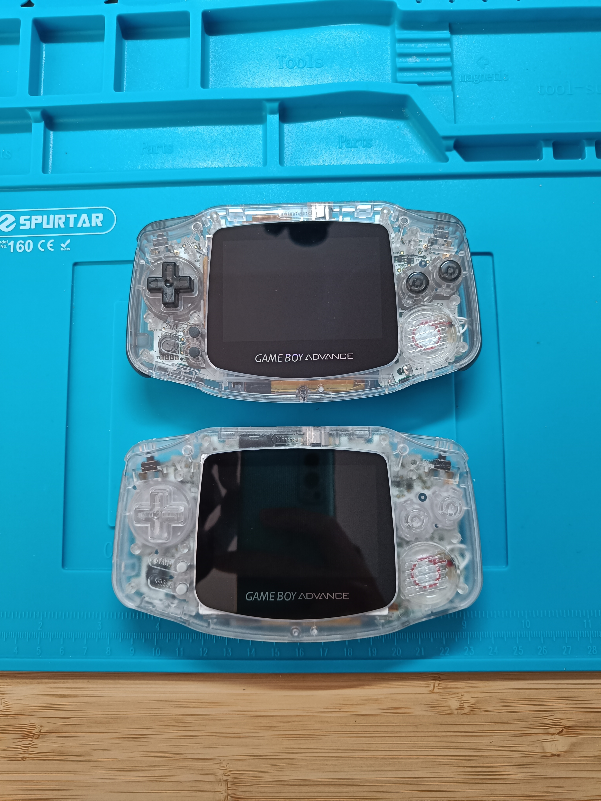
  

  

     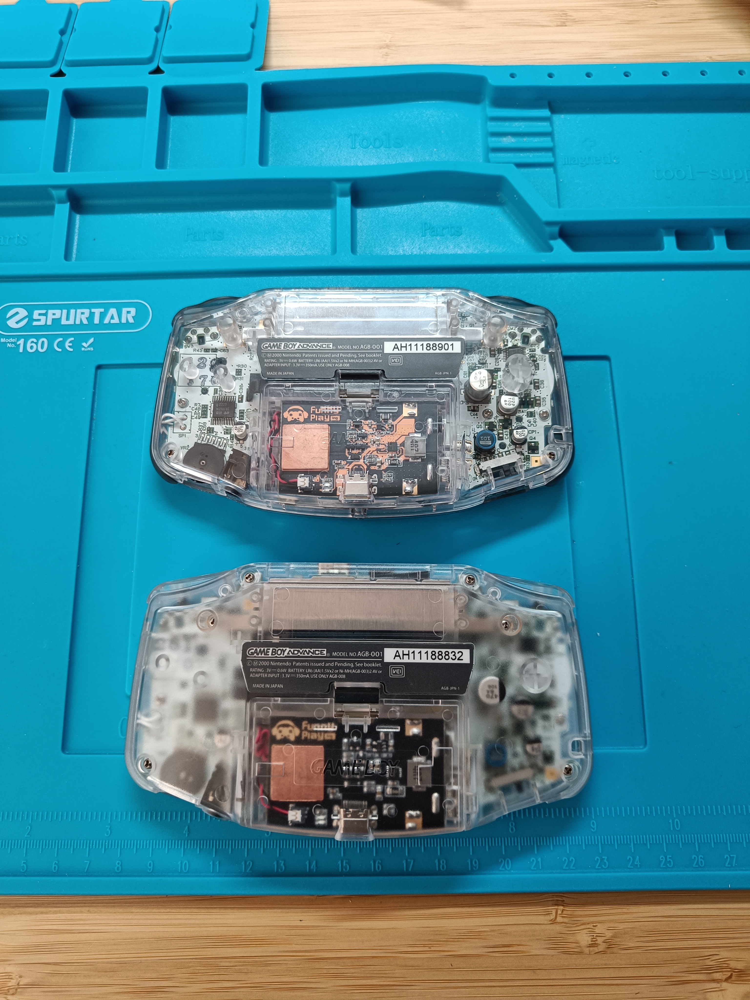
  

## Preparation

We'll need the following material:
- A donor GBA: the internals must be in good shape. The exterior state (including screen) doesn't matter because we are going to replace it.
- [3.0 Inch IPS AGB Laminated Kit: Display + Shell](https://funnyplaying.com/products/3-0-inch-ips-agb-laminated-kit)
- [GBA Li-Ion Rechargeable Battery USB-C Module](https://funnyplaying.com/products/gba-li-ion-rechargeable-battery-typec-module)
- [Clear GBA Speaker](https://funnyplaying.com/products/clear-gba-speaker)
- [GBA Replacement Silicone Pads](https://funnyplaying.com/products/replacement-silicone-pads-for-gameboy-advance) 
- [GBA Custom Buttons](https://funnyplaying.com/products/agb-custom-buttons)
- [Screwdrivers (Philips, tri-point and flathead)](https://www.ifixit.com/products/mako-driver-kit-64-precision-bits)
- Soldering iron, flux, and tin wire.
- Isopropyl alcohol 99%, brush, and microfiber cloth
- Kopton tape

## Preparing the motherboard

The first step is to retrieve the motherboard from our donor GBA. 

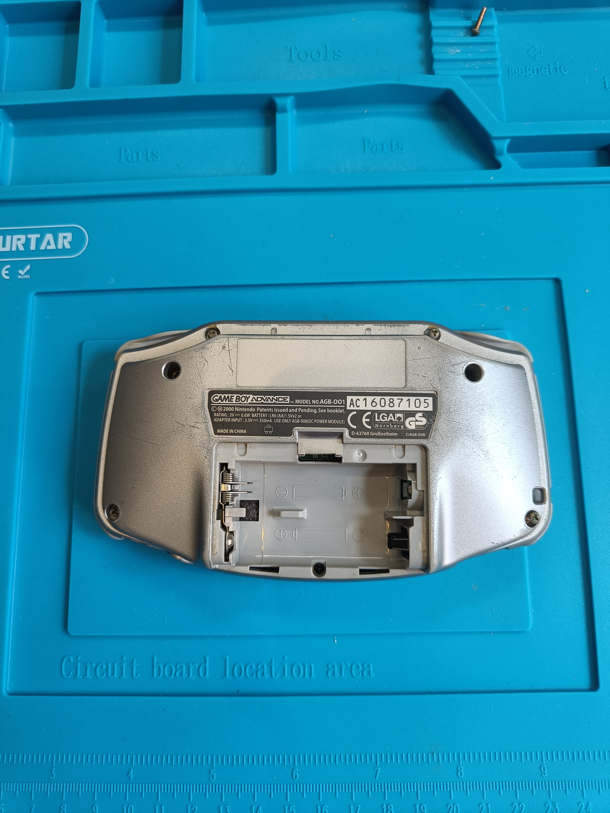

Open the back cover of your GBA by unscrewing the 6 tri-point screws and the philips screw at the bottom of the battery compartment.
I suggest using a shallowly tipped screwdriver for the philips screw, because it's quite weak and easy to strip.

The motherboard may be a little dirty at this point, but we will clean it later.

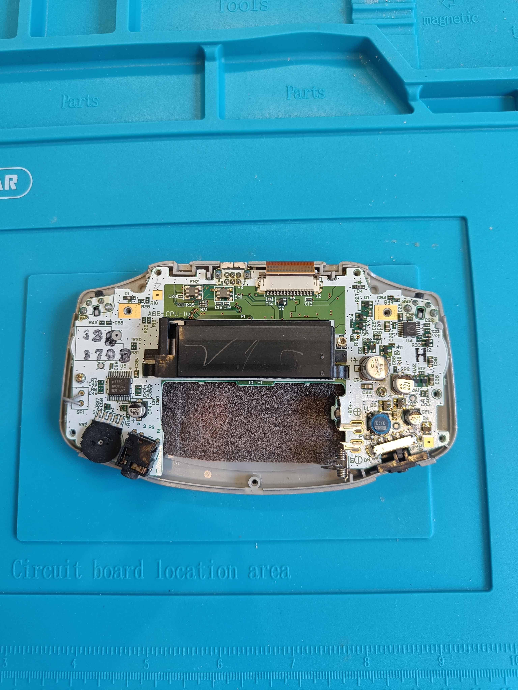

The Game Boy Advance had several hardware revisions over the years, but the most relevant change for us is the connector for the display.
The `3.0 Inch IPS AGB Laminated Kit` is compatible with both a 32-pin and a 40-pin screen connector.
My GBA has revision `10 1-1` (see under the cartridge), and uses the 32-pin connector. If your revision starts with `0` that means that your GBA uses the 40-pin connector. This information will be used in a following step.

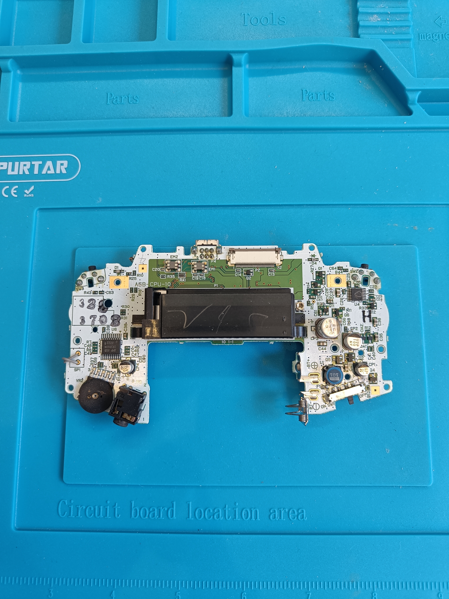

Next, we need to detach the display connector. Release the plastic holder by pulling up both sides and gently pull out the orange ribbon from the connector. Then, unscrew the 2 or 3 philips screws that hold the motherboard to the front shell half.

Before cleaning the motherboard, we will replace the speaker with the new one.
Desolder the old one and solder in the new one.

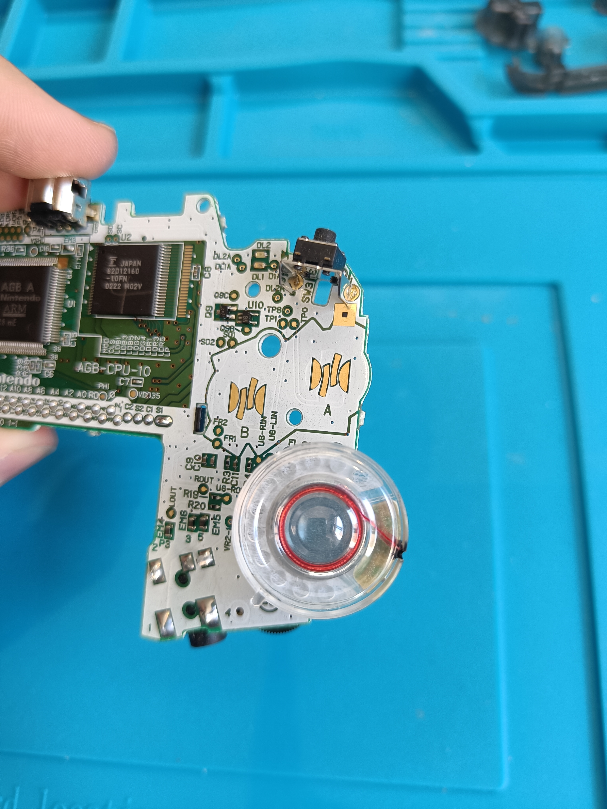

Now, we can clean all the dust and rust from the motherboard. We'll spray the motherboard with the isopropyl alcohol and brush the surface gently. Clean both sides of the motherboard. Do not worry about applying the isopropyl alcohol to the electronics, as it will evaporate while not damaging the components.

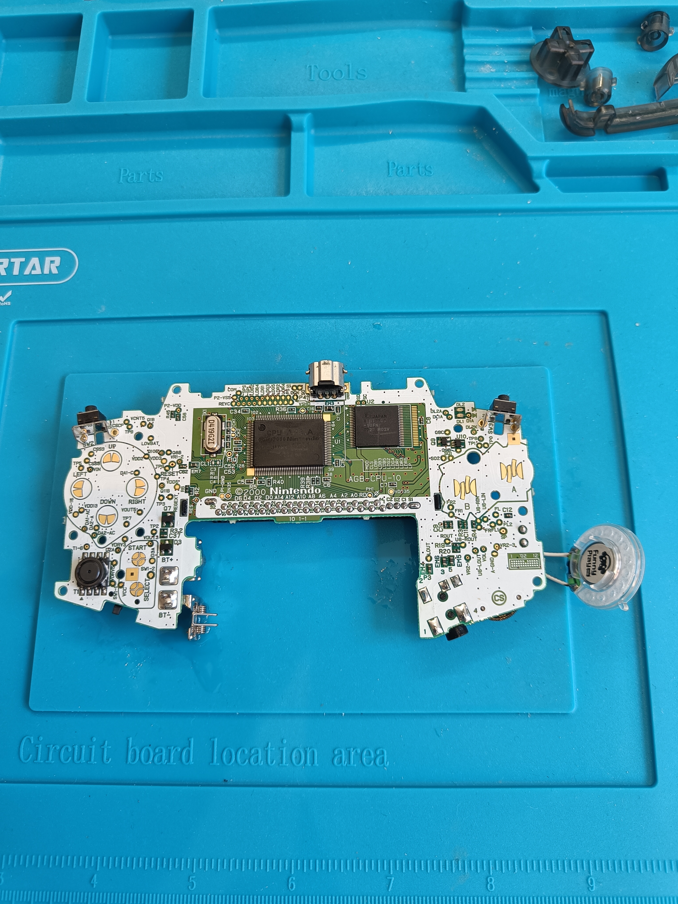

## Modding our GBA

The second step is to build a functional GBA on our new shell and with the IPS display.

  

    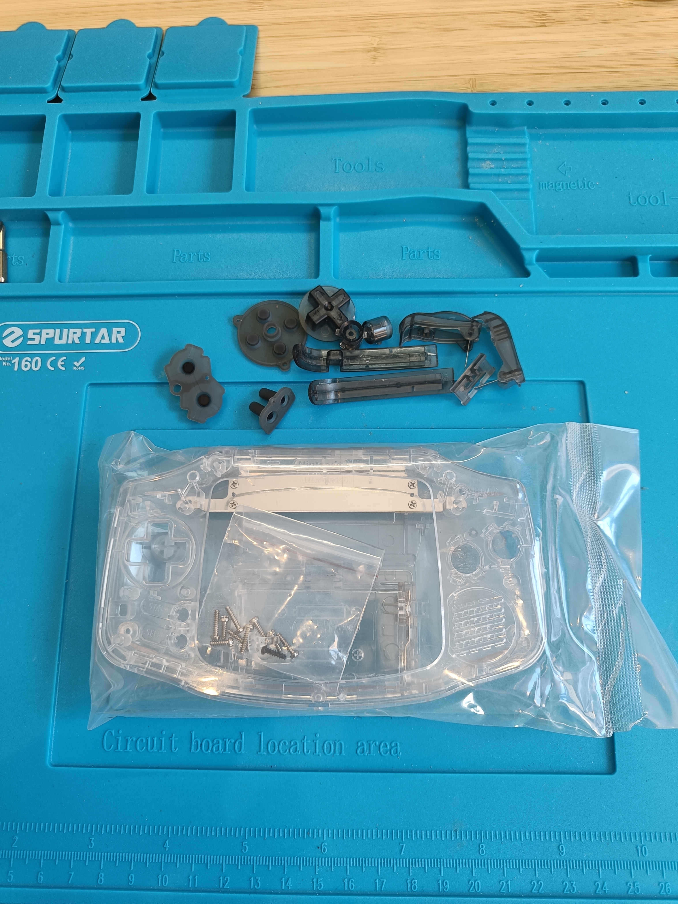
  

  

    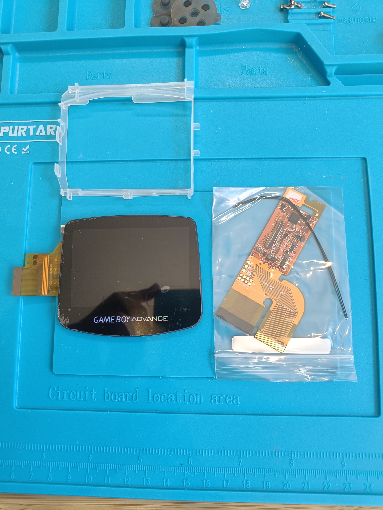
  

First, we'll prepare our IPS display by soldering the wires that will connect to the motherboard to control the OSD menu of the display.

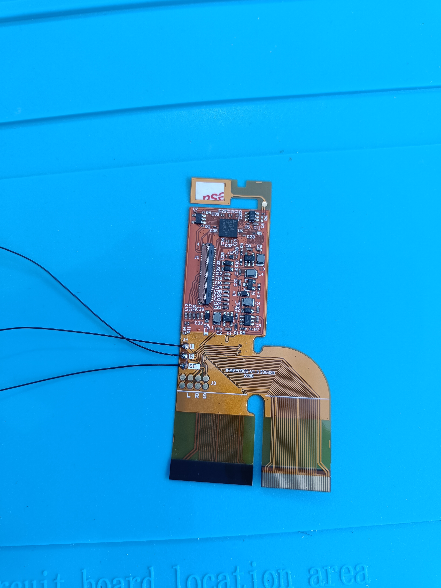

After that, I recommend covering with Kopton tape the pins of the connector that we are not going to use. In my case, the 40-pin connector.

Next, we will remove the plastic cover from the display and install the display on our front shell.

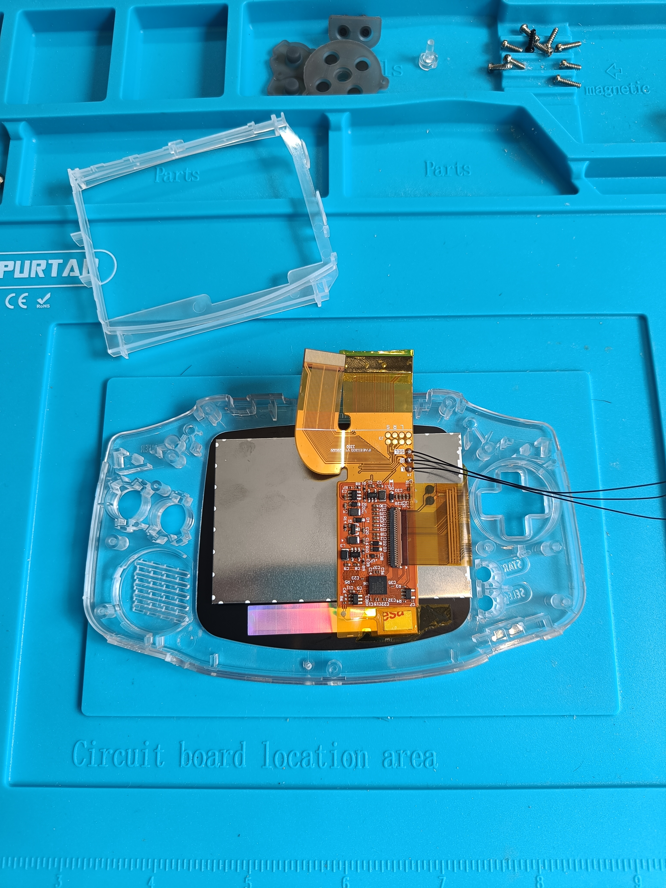

Then, we will attach the display ribbon to the display board. There is a small lid that has to be open before inserting the ribbon and has to be closed afterwards. I recommend sticking the board to the display's backplate with double-sided tape. The touch sensor must be attached to the bottom of the screen with Kopton tape. Do not forget to place the holding bracket to fix the screen in place.

The next step is to solder the wires to the GBA motherboard.

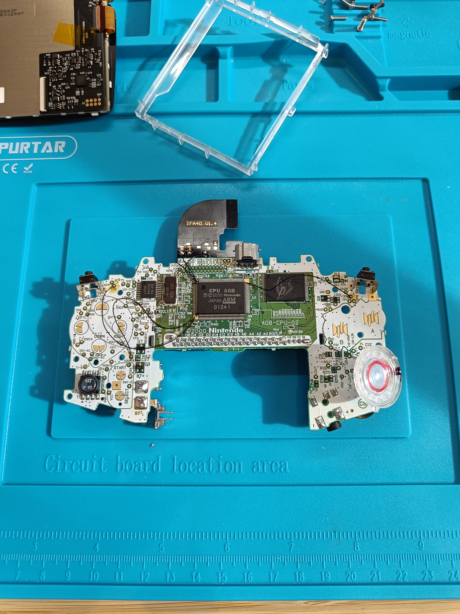

The picture above is from another mod (I forgot to take pictures from the current one), but the pins to solder the wires on are the same:
**S** must be soldered to `TP2`, **L** to `TP9`, and **R** to `TP8`.

> Some IPS kits require 40-pins motherboards to remove the `C54` capacitor.

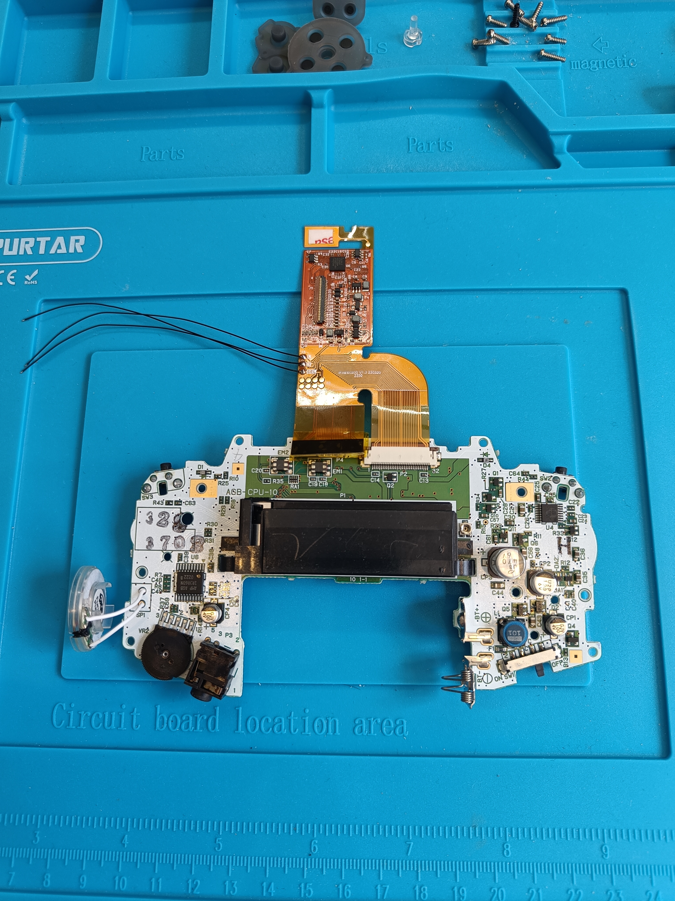

> The picture above is just an example of how the ribbon is connected to the motherboard, it is missing the folding and twisting of the ribbon.

Finally, we need to connect the 32-pin connector to the GBA motherboard. In order to do that, we have to twist the ribbon with the 32-pin connector 180°, and connect it to the GBA motherboard. 

It is now time to put the buttons and pads on their respective slots. Both are designed to only fit in a specific position and orientation. Don't forget to insert the power LED plastic diffuser.

The next step is the most challenging part of the process, so stay calm and repeat it as many times as needed.
Fold both parts by the ribbon to place the motherboard on top of the frontside shell. Make sure that the speaker is properly placed and the wires are not between the buttons and the motherboard contact pads. Using Kopton tape to fix some of the moving parts may help during the process.

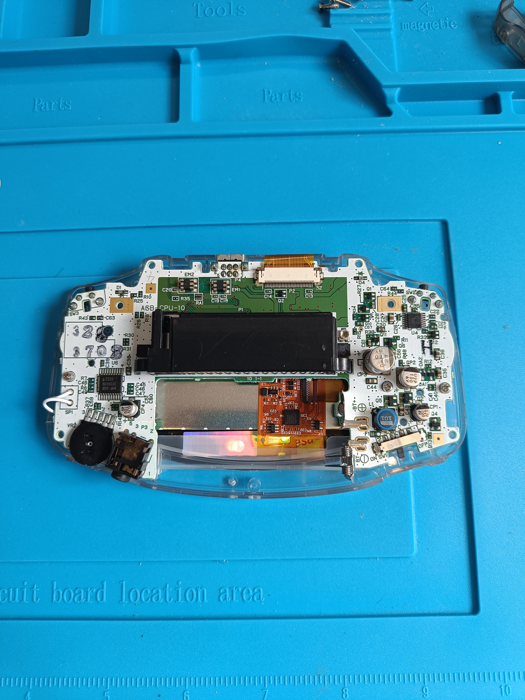

Screw the motherboard to the front shell and make sure everything fits by checking that the shell makes contact with the audio jack, the volume wheel and the top external connector.

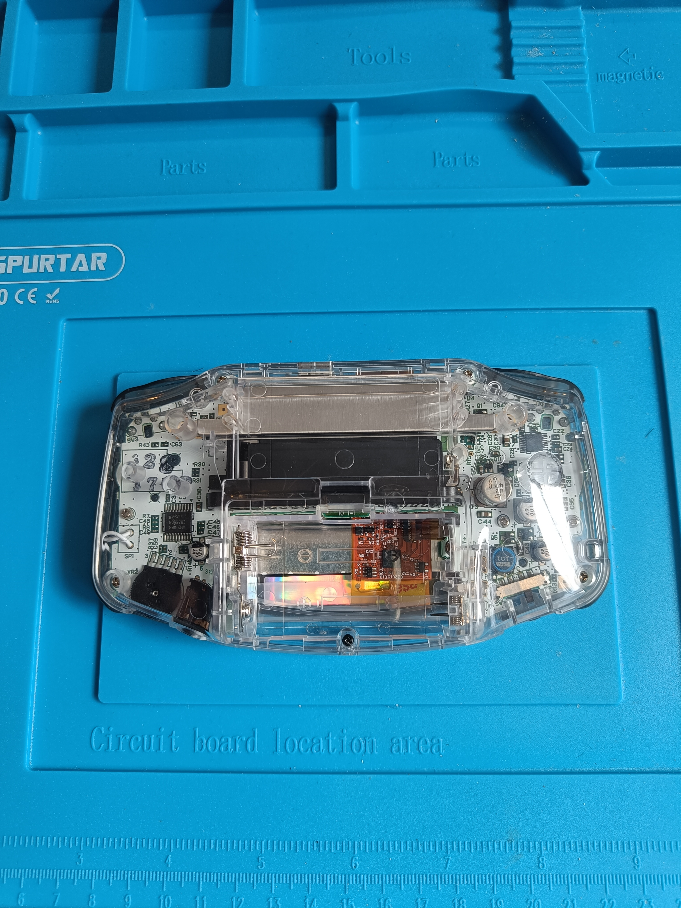

Finally, put the remaining buttons (bumper covers, trigger buttons, and power switch cover) on the shell and put the back shell on top of it. Make sure to screw the shell so that all connectors make proper contact before testing.

Now it is a good time to test your GBA. Put the batteries back in, turn it on and test that all buttons are still working.

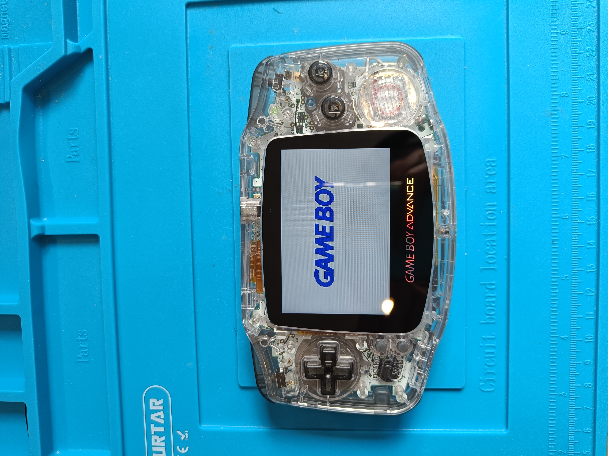

You can test the touch sensor by pressing the bottom of the screen. A single-tap should increase the brightness and a long-tap should display the OSD menu. See demo:

{{ youtube(id="IqRYh-b76Pw",class="video-wrapper") }}

You can test the soldered controllers by holding 'select' for 2 seconds to display the OSD menu and using the trigger buttons to increase and decrease the different values. See demo:

{{ youtube(id="-Ox0G2bGdoY",class="video-wrapper") }}

## Rechargeable battery

The final step is to replace the AA batteries compartment by a rechargeable USB-C battery.

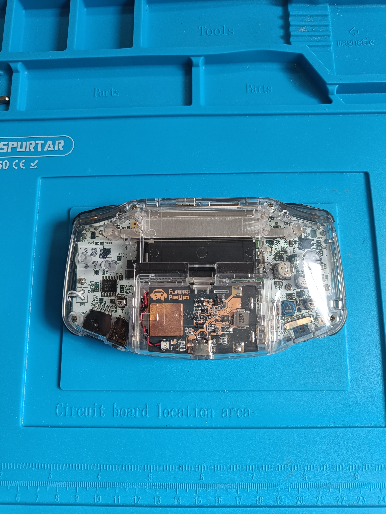

First, attach the heatsink to the battery's PCB and connect the battery power connector to the board.
Then, remove the left contact from the GBA AA batteries slot. 
I used a flathead screwdriver to push from the bottom of the contact.
And finally put the rechargeable battery in the batteries compartment.
Make sure the battery cable is placed inside the left contact cavity.
Put the cover back on. You may need to adjust the battery's position a bit to make it fit in the right place so the cover can close properly.

Time to enjoy your new modded GBA!

## Resources

- Retro gaming provider: <https://funnyplaying.com/>
- Video guide (from another author): <https://www.youtube.com/watch?v=BpX-2aeTXL4>
