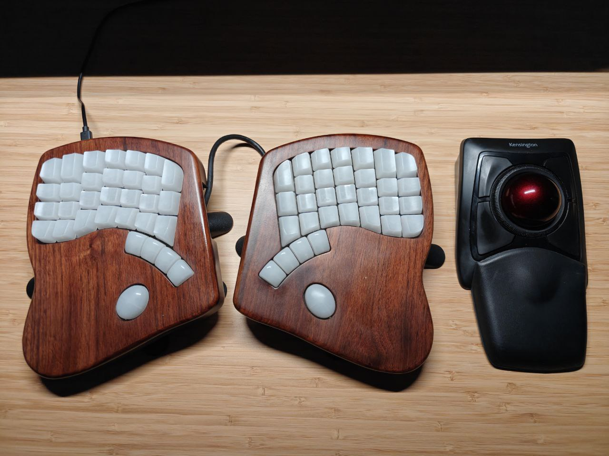

+++
title = "How I learnt to love trackball mice in Linux"
date = "2025-11-16"

[taxonomies]
tags=["linux", "trackball", "libinput"]

[extra]
repo_view = false
comment = false
+++

I fell in love with trackballs since I got my first one several years ago.
What I love about trackballs is that they take so little desk space since
they do not require a mouse pad nor need movement to displace the cursor.
I highly encourage people to try using a trackball. It is a lot of fun!

My first trackball was a Logitech MX Ergo, the version with the micro USB.
I discovered that scrolling for a long period of time
using the mouse wheel made my right hand hurt badly.
After some time, I had to drop the mouse for the Logitech MX Master.
I decided to go with this mouse because it has a feature called "MagSpeed scrolling".
This feature automatically switches the mouse wheel from ratched to free-spin mode,
which helped me a lot with my repetitive strain injury.

Despite the Logitech MX Master being an excellent productivity mouse,
I still missed using a trackball. Few months later, I discovered 
the Kensington Expert Wireless, a trackball that instead of a scrolling with
a regular mouse wheel it used the ring around the ball.

 

I didn't like the default mappings of the mouse. And the scrolling ring wasn't great.
Luckily, I discovered that you can also scroll using a mouse button and moving the cursor
up and down. Here is the script to achieve that:

```bash
#!/usr/bin/env bash

mouse_name="Kensington Expert Wireless TB Mouse"
mouse_id=$(xinput | grep "$mouse_name" | sed 's/^.*id=\([0-9]*\)[ \t].*$/\1/')

xinput set-button-map $mouse_id 1 8 2 4 5 6 7 3 9
xinput set-prop $mouse_id "libinput Natural Scrolling Enabled" 1
xinput set-prop $mouse_id "libinput Accel Profile Enabled" 0, 1
xinput set-prop $mouse_id "libinput Scroll Method Enabled" 0, 0, 1
xinput set-prop $mouse_id "libinput Button Scrolling Button" 3
```

This small change, made me fall in love with the mouse.

The only remaining problem was that the script was only executed once right after logging.
If I missed connecting the mouse, or switches the mouse to another computer, it reset 
and lost the custom mappings. At first, I re-executed the script manually. 
But it became a deal breaker, and eventually made me stop using the mouse.

Until today, when I discovered that you can have _X_ server apply the _libinput_ options
automatically to the device every time it matches its identifier. 
The set up is very simple: create a file `40-libinput.conf` with the following content

```
Section "InputClass"
        Identifier "Kensington Expert Wireless TB Mouse"
        MatchProduct "Kensington Expert Wireless TB Mouse"
        MatchIsPointer "on"
        Driver "libinput"
        Option "ButtonMapping" "1 8 2 4 5 6 7 3 9"
        Option "NaturalScrolling" "true"
        Option "AccelProfile" "flat"
        Option "ScrollMethod" "button"
        Option "ScrollButton" "3"
EndSection
```

and drop it in `/etc/X11/xorg.conf.d/`.
You can obtain the name with `libinput list-devices`.

This is the end of my little journey with mice on Linux.
If you liked this story, feel free to reach out and I will share more personal experiences.

**P.S.** Anyone knows how to achieve the same on macOS?
I tried Karabiner, but natural scrolling only applied to the scrolling wheel, not the scrolling button.
